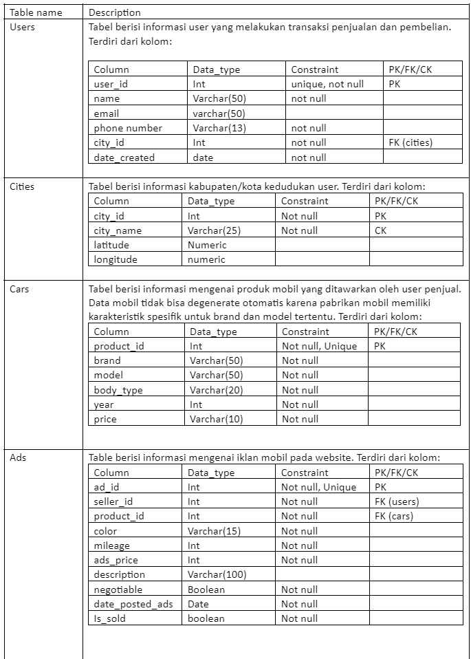
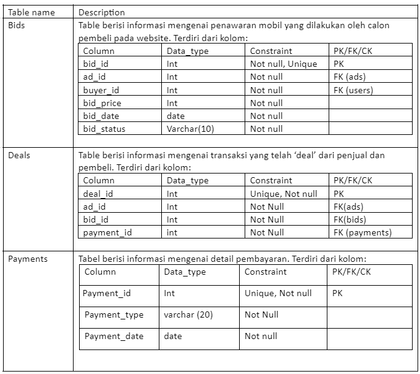
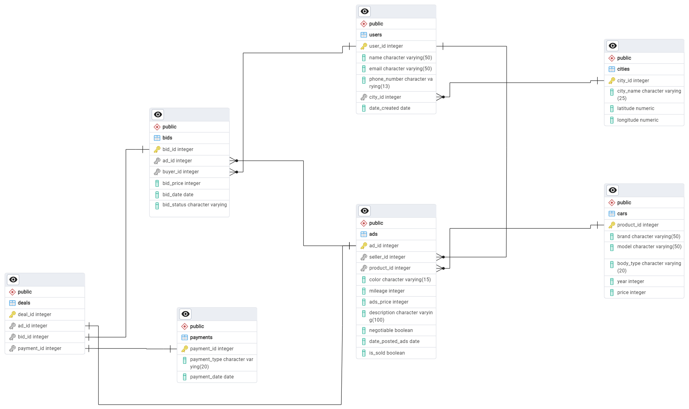

# Relational Database & SQL Project (Case: Ecommerce for selling used Car)
This is an SQL Project with PosgreSQL. Creating the database from the scratch and exploring it
## Project Description
Jualbelimobilkuy.com is an website e-commerce to sell and buy used car. This website is made for seller and buyer to do transaction for used car. To ease it's operational activities, the company store all the data into relational database using PosgreSQL. 
## Table Description
Description and business rule on the table is shown below:


## ERD
An entity–relationship model (or ER model) describes interrelated things of interest in a specific domain of knowledge. A basic ER model is composed of entity types (which classify the things of interest) and specifies relationships that can exist between entities (instances of those entity types). ERD of the data in the database can be shown in the picture below


## Creating Database and Tables
To create the database, you can run the script below
```sql
CREATE DATABASE ecommerce
    WITH
    OWNER = postgres
    ENCODING = 'UTF8'
    LOCALE_PROVIDER = 'libc'
    CONNECTION LIMIT = -1
    IS_TEMPLATE = False;

```
 

or you can run the script in 

To create the tables you can run the SQL file in 


## Generating Dummy Data

Used python with Faker module to generating dummy data, syntax can be accessed 

## Inputting Data
 With this syntax in 

## Retrieving the database

Exploring the data with queries! can be accessed  for Transactional query and  for analytical query!

## An Article on Medium
Saya menulis artikel secara lengkap di medium juga teman-teman. bisa diakses disini ya! 

## A Video on Youtube :)
